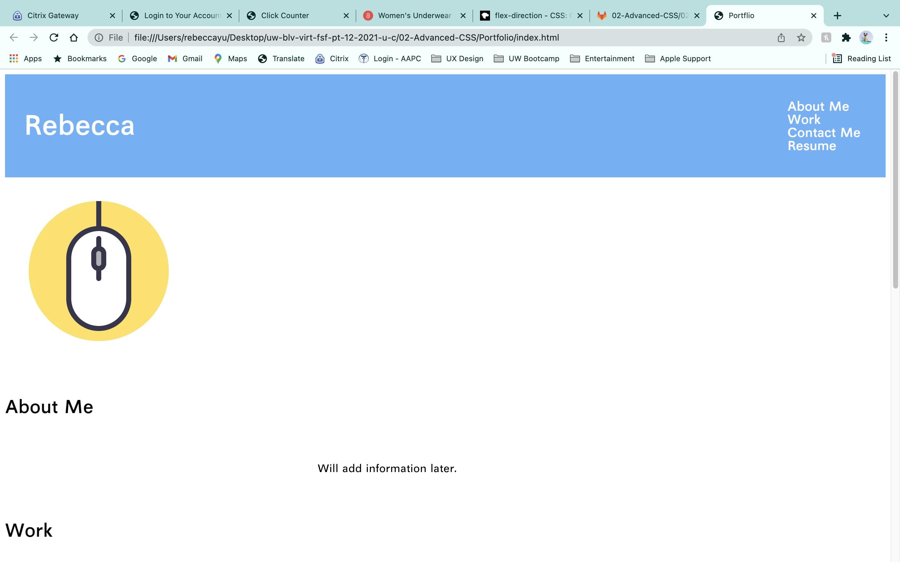
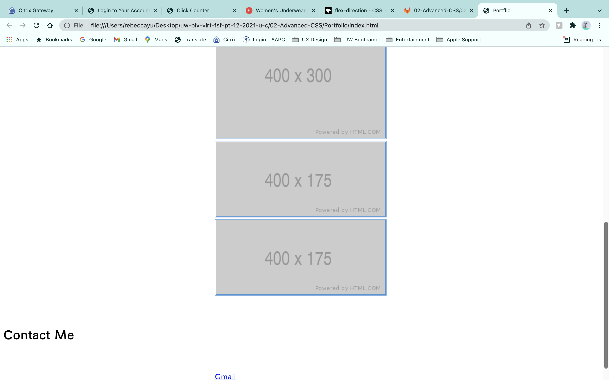
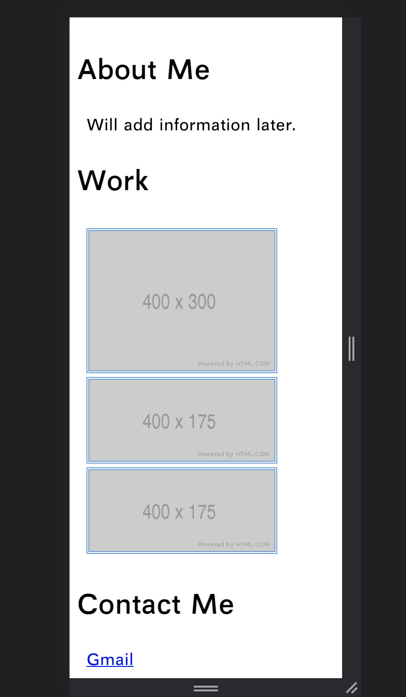
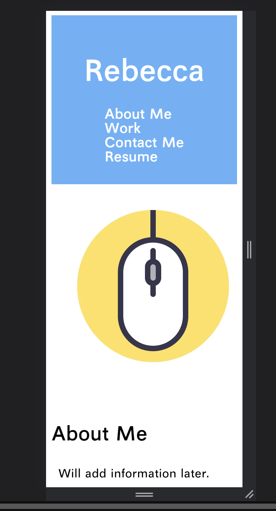

# Portfolio

Portfolio is a webpage with CSS and HTML that I have created for Week 2 Assignments that will later help me to introduce myself and showcase my works for potenital opportunites that may open.

# Installation

Use (https://becca6758.github.io/Portfolio/) to access Portfolio.

# Images

Full screen size

Mobile screen size

